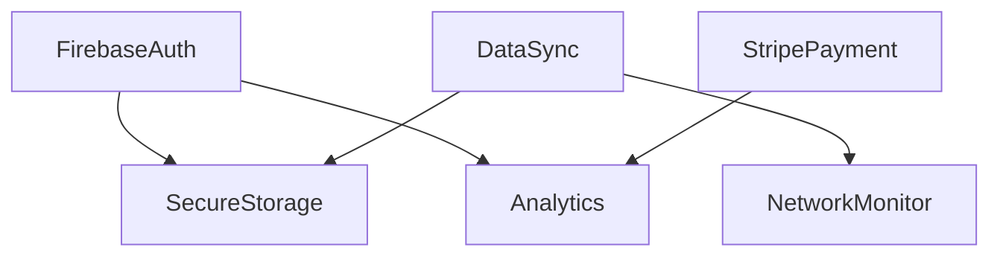

# DI Architecture: Advanced Patterns Reference (Tier 2)

**Document Purpose**: Advanced patterns, edge cases, complex scenarios for experienced developers
**Target Audience**: Senior developers, architects, complex multi-client scenarios
**Reading Time**: ~120 minutes
**Prerequisite**: Read Essential Production Guide first
**Version**: 2.1.0
**Last Updated**: 2025-12-27

---

## Table of Contents

1. [Contract Testing & Validation](#1-contract-testing--validation)
2. [Memory Management & Lifecycle](#2-memory-management--lifecycle)
3. [Package Versioning Strategy](#3-package-versioning-strategy)
4. [Offline-First Patterns](#4-offline-first-patterns)
5. [Platform-Specific Implementations](#5-platform-specific-implementations)
6. [Feature Flags & A/B Testing](#6-feature-flags--ab-testing)
7. [Service Decorator Pattern](#7-service-decorator-pattern)
8. [Anti-Patterns & When NOT to Use DI](#8-anti-patterns--when-not-to-use-di)
9. [Dependency Graph Visualization](#9-dependency-graph-visualization)
10. [Production Incident Response](#10-production-incident-response)

---

## 1. Contract Testing & Validation

### 1.1 Why Contract Testing Matters

In pure abstraction architecture, **interface contracts are the ONLY guarantee** between layers. When Client A uses Firebase and Client B uses Supabase, they both rely on `IAuthService` behaving identically.

**Real-world failure scenario**:
```typescript
// Firebase adapter
async login(email, password) {
  const result = await firebase.signInWithEmailAndPassword(email, password);
  return { userId: result.user.uid, email: result.user.email }; // ✅ Returns userId
}

// Supabase adapter (BROKEN CONTRACT)
async login(email, password) {
  const { data } = await supabase.auth.signInWithPassword({ email, password });
  return { id: data.user.id, email: data.user.email }; // ❌ Returns 'id' not 'userId'
}

// App breaks for Client B only
const App = () => {
  const authService = useService<IAuthService>(TYPES.IAuthService);
  const handleLogin = async () => {
    const user = await authService.login(email, password);
    console.log(user.userId); // ❌ undefined for Supabase clients!
  };
};
```

### 1.2 Shared Contract Test Suites

**Pattern**: Write test suite once, run against ALL implementations.

```typescript
// __tests__/contracts/IAuthService.contract.ts
import { IAuthService } from '@studio/core/interfaces';

/**
 * Contract test suite for IAuthService
 * Run this against EVERY implementation: Firebase, Supabase, Custom
 */
export const testAuthServiceContract = (
  implementationName: string,
  getImplementation: () => IAuthService
) => {
  describe(`IAuthService Contract: ${implementationName}`, () => {
    let authService: IAuthService;

    beforeEach(() => {
      authService = getImplementation();
    });

    describe('login()', () => {
      it('should return object with userId and email on success', async () => {
        const result = await authService.login('test@example.com', 'password123');

        // Contract requirements
        expect(result).toHaveProperty('userId');
        expect(result).toHaveProperty('email');
        expect(typeof result.userId).toBe('string');
        expect(typeof result.email).toBe('string');
        expect(result.email).toBe('test@example.com');
      });

      it('should throw AuthError with code "invalid-credentials" on bad password', async () => {
        await expect(
          authService.login('test@example.com', 'wrongpassword')
        ).rejects.toThrow(AuthError);

        try {
          await authService.login('test@example.com', 'wrongpassword');
        } catch (error) {
          expect(error.code).toBe('invalid-credentials'); // Contract requirement
        }
      });

      it('should throw AuthError with code "network-error" on offline', async () => {
        // Simulate offline
        // ... network simulation logic

        await expect(
          authService.login('test@example.com', 'password123')
        ).rejects.toThrow(AuthError);

        try {
          await authService.login('test@example.com', 'password123');
        } catch (error) {
          expect(error.code).toBe('network-error'); // Contract requirement
        }
      });
    });

    describe('logout()', () => {
      it('should succeed even if no user logged in (idempotent)', async () => {
        await expect(authService.logout()).resolves.not.toThrow();
        await expect(authService.logout()).resolves.not.toThrow(); // Second call
      });

      it('should clear session tokens', async () => {
        await authService.login('test@example.com', 'password123');
        await authService.logout();

        const user = await authService.getCurrentUser();
        expect(user).toBeNull(); // Contract: null when logged out
      });
    });

    describe('getCurrentUser()', () => {
      it('should return null when not logged in', async () => {
        const user = await authService.getCurrentUser();
        expect(user).toBeNull(); // Contract requirement
      });

      it('should return user object after login', async () => {
        await authService.login('test@example.com', 'password123');
        const user = await authService.getCurrentUser();

        expect(user).not.toBeNull();
        expect(user).toHaveProperty('userId');
        expect(user).toHaveProperty('email');
      });
    });

    describe('Performance contract', () => {
      it('login() should complete within 5 seconds', async () => {
        const start = Date.now();
        await authService.login('test@example.com', 'password123');
        const duration = Date.now() - start;

        expect(duration).toBeLessThan(5000); // Contract: max 5s
      });

      it('getCurrentUser() should complete within 500ms', async () => {
        await authService.login('test@example.com', 'password123');

        const start = Date.now();
        await authService.getCurrentUser();
        const duration = Date.now() - start;

        expect(duration).toBeLessThan(500); // Contract: max 500ms
      });
    });
  });
};
```

**Running contract tests against all implementations**:

```typescript
// __tests__/adapters/FirebaseAuthAdapter.test.ts
import { testAuthServiceContract } from '../contracts/IAuthService.contract';
import { FirebaseAuthAdapter } from '@studio/core-firebase/auth';
import { initializeTestFirebase } from './test-utils';

// Run shared contract tests
testAuthServiceContract('FirebaseAuthAdapter', () => {
  initializeTestFirebase();
  return new FirebaseAuthAdapter();
});

// Implementation-specific tests (optional)
describe('FirebaseAuthAdapter - Implementation Details', () => {
  it('should use Firebase SDK v10.x', () => {
    // Implementation-specific checks
  });
});
```

```typescript
// __tests__/adapters/SupabaseAuthAdapter.test.ts
import { testAuthServiceContract } from '../contracts/IAuthService.contract';
import { SupabaseAuthAdapter } from '@studio/core-supabase/auth';
import { initializeTestSupabase } from './test-utils';

// Same contract tests, different implementation
testAuthServiceContract('SupabaseAuthAdapter', () => {
  initializeTestSupabase();
  return new SupabaseAuthAdapter();
});
```

### 1.3 Runtime Contract Validation

For extra safety in development, validate contracts at runtime:

```typescript
// packages/core/src/validation/ServiceValidator.ts
import { IAuthService } from '../interfaces';

export class ServiceValidator {
  /**
   * Validates IAuthService implementation matches contract
   * Run in development/staging only
   */
  static async validateAuthService(service: IAuthService): Promise<void> {
    const errors: string[] = [];

    // Test 1: login() returns correct shape
    try {
      const mockResult = await service.login('test@test.com', 'password');
      if (!mockResult.userId || typeof mockResult.userId !== 'string') {
        errors.push('login() must return { userId: string, ... }');
      }
      if (!mockResult.email || typeof mockResult.email !== 'string') {
        errors.push('login() must return { email: string, ... }');
      }
    } catch (e) {
      // Expected to fail with mock credentials
    }

    // Test 2: getCurrentUser() returns null or user object
    try {
      const user = await service.getCurrentUser();
      if (user !== null && (!user.userId || !user.email)) {
        errors.push('getCurrentUser() must return null or { userId, email }');
      }
    } catch (e) {
      errors.push('getCurrentUser() threw unexpected error');
    }

    // Test 3: logout() is idempotent
    try {
      await service.logout();
      await service.logout(); // Should not throw
    } catch (e) {
      errors.push('logout() must be idempotent (safe to call twice)');
    }

    if (errors.length > 0) {
      throw new Error(`Contract validation failed:\n${errors.join('\n')}`);
    }
  }
}

// Use in development
if (__DEV__) {
  const container = createDIContainer();
  const authService = container.resolve<IAuthService>(TYPES.IAuthService);
  await ServiceValidator.validateAuthService(authService);
}
```

### 1.4 Contract Documentation

**Best practice**: Document contracts in interface files with JSDoc.

```typescript
// packages/core/src/interfaces/IAuthService.ts
export interface IAuthService {
  /**
   * Authenticates user with email and password
   *
   * @param email - User's email address
   * @param password - User's password
   *
   * @returns Promise resolving to user object with userId and email
   *
   * @throws {AuthError} with code 'invalid-credentials' if credentials wrong
   * @throws {AuthError} with code 'network-error' if network failure
   * @throws {AuthError} with code 'user-disabled' if account disabled
   *
   * @contract Return value MUST include:
   *   - userId: string (unique identifier)
   *   - email: string (normalized lowercase)
   *
   * @contract Performance: MUST complete within 5 seconds
   *
   * @contract Error codes MUST match exactly:
   *   - 'invalid-credentials'
   *   - 'network-error'
   *   - 'user-disabled'
   *
   * @example
   * ```typescript
   * const user = await authService.login('user@example.com', 'password123');
   * console.log(user.userId); // "abc123"
   * console.log(user.email);  // "user@example.com"
   * ```
   */
  login(email: string, password: string): Promise<AuthUser>;

  /**
   * Signs out current user
   *
   * @contract MUST be idempotent (safe to call multiple times)
   * @contract MUST succeed even if no user logged in
   * @contract MUST clear all session tokens
   *
   * @example
   * ```typescript
   * await authService.logout(); // ✅ Success
   * await authService.logout(); // ✅ Still success (idempotent)
   * ```
   */
  logout(): Promise<void>;

  /**
   * Gets currently authenticated user
   *
   * @returns Promise resolving to user object or null if not logged in
   *
   * @contract MUST return null when no user logged in
   * @contract MUST NOT throw error when no user logged in
   * @contract Performance: MUST complete within 500ms
   *
   * @example
   * ```typescript
   * const user = await authService.getCurrentUser();
   * if (user) {
   *   console.log(user.userId);
   * } else {
   *   console.log('Not logged in'); // ✅ Returns null, not error
   * }
   * ```
   */
  getCurrentUser(): Promise<AuthUser | null>;
}
```

### 1.5 Contract Testing CI/CD Integration

```yaml
# .github/workflows/contract-tests.yml
name: Contract Tests

on: [push, pull_request]

jobs:
  test-contracts:
    runs-on: ubuntu-latest
    strategy:
      matrix:
        # Test EVERY implementation
        implementation:
          - firebase
          - supabase
          - auth0
          - custom

    steps:
      - uses: actions/checkout@v3
      - uses: actions/setup-node@v3

      - name: Install dependencies
        run: yarn install

      - name: Run contract tests for ${{ matrix.implementation }}
        run: yarn test:contracts --implementation=${{ matrix.implementation }}
        env:
          # Load secrets for each implementation
          FIREBASE_CONFIG: ${{ secrets.FIREBASE_TEST_CONFIG }}
          SUPABASE_URL: ${{ secrets.SUPABASE_TEST_URL }}
          AUTH0_DOMAIN: ${{ secrets.AUTH0_TEST_DOMAIN }}

      - name: Upload test results
        if: failure()
        uses: actions/upload-artifact@v3
        with:
          name: contract-test-results-${{ matrix.implementation }}
          path: test-results/
```

---

## 2. Memory Management & Lifecycle

### 2.1 Singleton Memory Leaks

**Problem**: Singleton services live for entire app lifetime. If they hold references to React components, routes, or event listeners, **memory leaks are inevitable**.

```typescript
// ❌ MEMORY LEAK EXAMPLE
@singleton()
export class AnalyticsService implements IAnalyticsService {
  private listeners: Function[] = []; // ❌ Never cleaned up!

  trackEvent(event: string, data: any) {
    this.listeners.forEach(listener => listener(event, data));
  }

  // Components call this
  addEventListener(listener: Function) {
    this.listeners.push(listener); // ❌ Leak: listener never removed
  }
}

// Component mounts/unmounts repeatedly
const MyComponent = () => {
  const analytics = useService<IAnalyticsService>(TYPES.IAnalyticsService);

  useEffect(() => {
    const listener = (event) => console.log(event);
    analytics.addEventListener(listener); // ❌ Added on every mount

    // ❌ MISSING CLEANUP!
    // return () => analytics.removeEventListener(listener);
  }, []);
};

// After 100 navigation cycles: 100 listeners in memory!
```

### 2.2 Proper Cleanup Patterns

**Pattern 1: Disposable Services**

```typescript
// packages/core/src/interfaces/IDisposable.ts
export interface IDisposable {
  dispose(): void | Promise<void>;
}

// Implementation with cleanup
@singleton()
export class AnalyticsService implements IAnalyticsService, IDisposable {
  private listeners = new Set<Function>(); // Use Set for O(1) removal

  addEventListener(listener: Function): () => void {
    this.listeners.add(listener);

    // ✅ Return cleanup function
    return () => this.listeners.delete(listener);
  }

  trackEvent(event: string, data: any) {
    this.listeners.forEach(listener => listener(event, data));
  }

  dispose() {
    this.listeners.clear(); // ✅ Cleanup on app shutdown
  }
}

// React hook with automatic cleanup
const MyComponent = () => {
  const analytics = useService<IAnalyticsService>(TYPES.IAnalyticsService);

  useEffect(() => {
    const listener = (event) => console.log(event);
    const unsubscribe = analytics.addEventListener(listener);

    return () => unsubscribe(); // ✅ Cleaned up on unmount
  }, []);
};
```

**Pattern 2: WeakMap for Component References**

```typescript
@singleton()
export class NavigationService implements INavigationService {
  // ❌ BAD: Strong references to components
  // private routeHandlers = new Map<string, ComponentType>();

  // ✅ GOOD: Weak references (garbage collected when component unmounts)
  private routeHandlers = new WeakMap<object, ComponentType>();

  registerRoute(key: object, component: ComponentType) {
    this.routeHandlers.set(key, component);
    // When key is garbage collected, entry auto-removed
  }
}
```

**Pattern 3: Subscription Management**

```typescript
@singleton()
export class RealtimeService implements IRealtimeService {
  private subscriptions = new Map<string, Subscription>();

  subscribe(channel: string, callback: Function): () => void {
    const subscription = this.backend.subscribe(channel, callback);
    const subscriptionId = `${channel}-${Date.now()}`;

    this.subscriptions.set(subscriptionId, subscription);

    // Return unsubscribe function
    return () => {
      const sub = this.subscriptions.get(subscriptionId);
      if (sub) {
        sub.unsubscribe(); // ✅ Clean up backend subscription
        this.subscriptions.delete(subscriptionId); // ✅ Remove from map
      }
    };
  }

  dispose() {
    // ✅ Clean up all subscriptions on app shutdown
    this.subscriptions.forEach(sub => sub.unsubscribe());
    this.subscriptions.clear();
  }
}
```

### 2.3 React Hook Memory Safety

```typescript
// packages/core-react/src/hooks/useService.ts
export function useService<T>(token: symbol): T {
  const container = useDIContainer();

  // ✅ CORRECT: useMemo prevents re-resolution
  return useMemo(() => {
    return container.resolve<T>(token);
  }, [container, token]);
}

// ❌ WRONG: Creates new instance on every render (for transient services)
export function useServiceWrong<T>(token: symbol): T {
  const container = useDIContainer();
  return container.resolve<T>(token); // ❌ Called every render!
}
```

**Custom hook for services with cleanup**:

```typescript
// packages/core-react/src/hooks/useDisposableService.ts
export function useDisposableService<T extends IDisposable>(
  token: symbol
): T {
  const container = useDIContainer();
  const service = useMemo(() => container.resolve<T>(token), [container, token]);

  useEffect(() => {
    // Cleanup when component unmounts
    return () => {
      service.dispose();
    };
  }, [service]);

  return service;
}

// Usage
const MyComponent = () => {
  const realtime = useDisposableService<IRealtimeService>(TYPES.IRealtimeService);
  // ✅ Automatically disposed on unmount
};
```

### 2.4 Memory Profiling

**Detect leaks in development**:

```typescript
// packages/core/src/debug/MemoryMonitor.ts
export class MemoryMonitor {
  private static snapshots: any[] = [];

  static takeSnapshot(label: string) {
    if (__DEV__ && typeof performance !== 'undefined') {
      const memory = (performance as any).memory;
      if (memory) {
        this.snapshots.push({
          label,
          timestamp: Date.now(),
          usedJSHeapSize: memory.usedJSHeapSize,
          totalJSHeapSize: memory.totalJSHeapSize,
        });

        // Warn if heap grows > 50MB between snapshots
        if (this.snapshots.length > 1) {
          const prev = this.snapshots[this.snapshots.length - 2];
          const current = this.snapshots[this.snapshots.length - 1];
          const growth = current.usedJSHeapSize - prev.usedJSHeapSize;

          if (growth > 50 * 1024 * 1024) {
            console.warn(
              `⚠️ Memory growth detected: ${(growth / 1024 / 1024).toFixed(2)}MB`,
              `\n  From: ${prev.label}`,
              `\n  To: ${current.label}`
            );
          }
        }
      }
    }
  }

  static getReport() {
    return this.snapshots;
  }
}

// Use in app lifecycle
if (__DEV__) {
  MemoryMonitor.takeSnapshot('App Start');

  // After navigation
  navigation.addListener('state', () => {
    MemoryMonitor.takeSnapshot('After Navigation');
  });
}
```

### 2.5 Service Lifecycle Comparison

| Lifecycle | Memory Impact | Use Cases | Cleanup Required |
|-----------|---------------|-----------|------------------|
| **Singleton** | High (lives entire app) | AuthService, AnalyticsService | Yes (dispose pattern) |
| **Transient** | Low (GC'd when done) | Validators, formatters, utils | No |
| **Scoped** | Medium (lives per scope) | Request handlers, session data | Yes (per scope) |

**Recommendation**: Default to **singleton** with **dispose pattern** for 95% of services.

---

## 3. Package Versioning Strategy

### 3.1 Interface Versioning

**Problem**: When you update an interface, ALL implementations must update. How do you manage breaking changes across 20+ clients?

**Solution**: Semantic versioning + deprecation strategy.

```typescript
// packages/core/src/interfaces/IAuthService.ts

/**
 * IAuthService v2.0.0
 *
 * Breaking changes from v1.x:
 * - login() now requires 2FA token parameter
 * - getCurrentUser() returns Promise instead of sync
 *
 * Migration guide: /docs/migrations/auth-service-v1-to-v2.md
 */
export interface IAuthService {
  /**
   * @since 2.0.0
   * @param twoFactorToken Required for 2FA-enabled accounts
   */
  login(email: string, password: string, twoFactorToken?: string): Promise<AuthUser>;

  /**
   * @since 2.0.0
   * @breaking Changed from sync to async in v2.0.0
   */
  getCurrentUser(): Promise<AuthUser | null>;
}
```

### 3.2 Backward Compatibility Adapters

**Pattern**: Support both v1 and v2 during migration period.

```typescript
// packages/core/src/interfaces/IAuthService.v1.ts (deprecated)
/**
 * @deprecated Use IAuthService v2.0.0 instead
 * This interface will be removed in v3.0.0 (Q2 2026)
 */
export interface IAuthServiceV1 {
  login(email: string, password: string): Promise<AuthUser>;
  getCurrentUserSync(): AuthUser | null; // Sync version
}

// packages/core/src/adapters/AuthServiceV1ToV2Adapter.ts
/**
 * Adapter: Makes v2 implementation compatible with v1 interface
 * Use this for gradual migration
 */
@injectable()
export class AuthServiceV1ToV2Adapter implements IAuthServiceV1 {
  constructor(
    @inject(TYPES.IAuthService) private v2Service: IAuthService
  ) {}

  async login(email: string, password: string): Promise<AuthUser> {
    // Call v2 without 2FA token
    return this.v2Service.login(email, password, undefined);
  }

  getCurrentUserSync(): AuthUser | null {
    // ⚠️ Sync wrapper over async (blocks thread, not recommended)
    let user: AuthUser | null = null;
    this.v2Service.getCurrentUser().then(u => user = u);
    return user;
  }
}

// Client A (not ready for v2 yet)
container.register<IAuthServiceV1>(TYPES.IAuthServiceV1, {
  useClass: AuthServiceV1ToV2Adapter, // ✅ Uses v2 under the hood
});

// Client B (migrated to v2)
container.register<IAuthService>(TYPES.IAuthService, {
  useClass: FirebaseAuthAdapter, // ✅ Native v2 implementation
});
```

### 3.3 Changesets for Monorepo

**Tool**: Use [Changesets](https://github.com/changesets/changesets) to manage versions across packages.

```bash
yarn add -D @changesets/cli
yarn changeset init
```

**Workflow**:

```bash
# Developer makes breaking change to IAuthService
# 1. Create changeset
yarn changeset

# Prompts:
# - Which packages changed? @studio/core
# - What type of change? major (breaking)
# - Summary: "Updated IAuthService to require 2FA token"

# Creates .changeset/random-name.md:
```

```markdown
---
"@studio/core": major
"@studio/core-firebase": major
"@studio/core-supabase": major
---

**BREAKING CHANGE**: IAuthService.login() now requires optional 2FA token parameter.

Migration:
- Update all login() calls: `login(email, password)` → `login(email, password, twoFactorToken)`
- See migration guide: /docs/migrations/auth-service-v1-to-v2.md
```

```bash
# 2. On merge to main, CI runs:
yarn changeset version

# This updates package.json versions:
# @studio/core: 1.5.2 → 2.0.0
# @studio/core-firebase: 1.3.1 → 2.0.0
# @studio/core-supabase: 1.2.0 → 2.0.0

# 3. Publish
yarn changeset publish
```

### 3.4 Breaking Change Communication

**Best practice**: Announce breaking changes 1 sprint in advance.

```typescript
// packages/core/src/interfaces/IAuthService.ts

/**
 * @deprecated Use login(email, password, twoFactorToken) instead
 * This overload will be removed in v3.0.0 (June 2026)
 *
 * @see https://docs.studio.com/migrations/auth-v2-to-v3
 */
export interface IAuthService {
  /**
   * @deprecated Remove 2FA-less login in v3.0.0
   */
  login(email: string, password: string): Promise<AuthUser>;

  /**
   * @since v2.5.0
   * @stable This is the preferred signature going forward
   */
  login(email: string, password: string, twoFactorToken: string): Promise<AuthUser>;
}
```

**Deprecation warnings**:

```typescript
// packages/core/src/adapters/FirebaseAuthAdapter.ts
@injectable()
export class FirebaseAuthAdapter implements IAuthService {
  async login(email: string, password: string, twoFactorToken?: string): Promise<AuthUser> {
    if (!twoFactorToken && __DEV__) {
      console.warn(
        '⚠️ DEPRECATION WARNING: Calling login() without 2FA token is deprecated.',
        '\n  This will be removed in @studio/core v3.0.0 (June 2026).',
        '\n  Please update: login(email, password, twoFactorToken)',
        '\n  Migration guide: https://docs.studio.com/migrations/auth-v2-to-v3'
      );
    }
    // ... implementation
  }
}
```

### 3.5 Version Compatibility Matrix

Track which client uses which interface version:

```typescript
// tools/version-matrix.ts
export const CLIENT_INTERFACE_VERSIONS = {
  'client-a': {
    '@studio/core': '2.0.0',
    IAuthService: 'v2',
    IPaymentService: 'v1', // Not migrated yet
  },
  'client-b': {
    '@studio/core': '3.0.0-beta',
    IAuthService: 'v3', // Early adopter
    IPaymentService: 'v2',
  },
  'client-c': {
    '@studio/core': '1.5.2',
    IAuthService: 'v1', // Legacy client
    IPaymentService: 'v1',
  },
};

// CI checks: ensure client uses compatible versions
if (CLIENT_INTERFACE_VERSIONS[clientName].IAuthService === 'v1') {
  console.warn(`⚠️ ${clientName} uses deprecated IAuthService v1`);
  console.warn(`   Migrate to v2 before June 2026 when v1 support ends`);
}
```

---

## 4. Offline-First Patterns

### 4.1 Why Offline-First Matters for Studio

Mobile apps must work **without network**. In DI architecture, offline support becomes a **cross-cutting concern** affecting ALL services.

**Key insight**: Offline mode is NOT about "wrapping services with try/catch". It's about:
1. **Queue management** (actions while offline)
2. **Cache synchronization** (local-first, sync later)
3. **Conflict resolution** (what if server changed?)

### 4.2 Offline-Aware Service Pattern

```typescript
// packages/core/src/interfaces/IOfflineCapable.ts
export interface IOfflineCapable {
  /**
   * Queue operation for later execution when online
   */
  queueForSync(operation: Operation): Promise<void>;

  /**
   * Process queued operations (called when network restored)
   */
  syncQueue(): Promise<SyncResult>;

  /**
   * Check if service can fulfill request offline
   */
  canOperateOffline(operation: string): boolean;
}

// Example: Offline-aware AuthService
@singleton()
export class OfflineAuthService implements IAuthService, IOfflineCapable {
  constructor(
    @inject(TYPES.IAuthService) private onlineService: IAuthService,
    @inject(TYPES.ISecureStorage) private storage: ISecureStorage,
    @inject(TYPES.INetworkMonitor) private network: INetworkMonitor
  ) {}

  async login(email: string, password: string): Promise<AuthUser> {
    if (this.network.isOnline()) {
      // ✅ Online: normal flow
      const user = await this.onlineService.login(email, password);
      await this.cacheUser(user); // Cache for offline access
      return user;
    } else {
      // ⚠️ Offline: check cache
      const cachedUser = await this.getCachedUser(email);
      if (cachedUser && await this.verifyCachedPassword(email, password)) {
        return cachedUser; // ✅ Return cached credentials
      }
      throw new AuthError('Cannot login offline without cached credentials', 'offline-login-failed');
    }
  }

  async getCurrentUser(): Promise<AuthUser | null> {
    // ✅ Can always return cached user (offline-friendly)
    return this.getCachedUser();
  }

  async updateProfile(userId: string, updates: ProfileUpdate): Promise<void> {
    if (this.network.isOnline()) {
      await this.onlineService.updateProfile(userId, updates);
    } else {
      // ✅ Queue for sync when online
      await this.queueForSync({
        type: 'updateProfile',
        userId,
        updates,
        timestamp: Date.now(),
      });
    }
  }

  canOperateOffline(operation: string): boolean {
    // Define which operations work offline
    return ['getCurrentUser', 'login'].includes(operation);
  }

  async syncQueue(): Promise<SyncResult> {
    const queue = await this.storage.getItem<Operation[]>('auth_sync_queue') || [];
    const results = { success: 0, failed: 0 };

    for (const op of queue) {
      try {
        if (op.type === 'updateProfile') {
          await this.onlineService.updateProfile(op.userId, op.updates);
          results.success++;
        }
      } catch (error) {
        results.failed++;
      }
    }

    // Clear successful operations
    await this.storage.setItem('auth_sync_queue', []);
    return results;
  }

  private async queueForSync(operation: Operation): Promise<void> {
    const queue = await this.storage.getItem<Operation[]>('auth_sync_queue') || [];
    queue.push(operation);
    await this.storage.setItem('auth_sync_queue', queue);
  }
}
```

### 4.3 Network Status Monitor

```typescript
// packages/core/src/services/NetworkMonitor.ts
@singleton()
export class NetworkMonitor implements INetworkMonitor {
  private listeners = new Set<(isOnline: boolean) => void>();
  private _isOnline = true;

  constructor() {
    this.setupListeners();
  }

  private setupListeners() {
    if (typeof window !== 'undefined') {
      window.addEventListener('online', () => this.handleStatusChange(true));
      window.addEventListener('offline', () => this.handleStatusChange(false));
    }

    // React Native
    if (typeof NetInfo !== 'undefined') {
      NetInfo.addEventListener(state => {
        this.handleStatusChange(state.isConnected ?? false);
      });
    }
  }

  private handleStatusChange(isOnline: boolean) {
    if (this._isOnline !== isOnline) {
      this._isOnline = isOnline;
      this.listeners.forEach(listener => listener(isOnline));

      if (isOnline) {
        // Trigger sync when coming back online
        this.triggerSync();
      }
    }
  }

  isOnline(): boolean {
    return this._isOnline;
  }

  onStatusChange(listener: (isOnline: boolean) => void): () => void {
    this.listeners.add(listener);
    return () => this.listeners.delete(listener);
  }

  private async triggerSync() {
    // Resolve all offline-capable services and sync their queues
    const services = [
      container.resolve<IOfflineCapable>(TYPES.IAuthService),
      container.resolve<IOfflineCapable>(TYPES.IDataService),
      // ... other services
    ];

    await Promise.all(services.map(s => s.syncQueue()));
  }
}
```

### 4.4 Optimistic Updates with Rollback

```typescript
// packages/core/src/patterns/OptimisticUpdate.ts
export class OptimisticUpdateService {
  constructor(
    @inject(TYPES.IDataService) private dataService: IDataService,
    @inject(TYPES.INetworkMonitor) private network: INetworkMonitor
  ) {}

  async updateWithOptimism<T>(
    localUpdate: () => void,
    serverUpdate: () => Promise<T>,
    rollback: () => void
  ): Promise<T> {
    // 1. Apply local change immediately (UI updates instantly)
    localUpdate();

    try {
      // 2. Send to server
      const result = await serverUpdate();
      return result; // ✅ Server confirmed, keep local change
    } catch (error) {
      // 3. Server failed, rollback local change
      rollback();
      throw error;
    }
  }
}

// Usage example
const TodoListComponent = () => {
  const [todos, setTodos] = useState<Todo[]>([]);
  const optimistic = useService<OptimisticUpdateService>(TYPES.OptimisticUpdate);

  const handleToggleTodo = async (id: string) => {
    const todo = todos.find(t => t.id === id);
    if (!todo) return;

    await optimistic.updateWithOptimism(
      // Local update (instant UI feedback)
      () => setTodos(todos.map(t => t.id === id ? { ...t, completed: !t.completed } : t)),

      // Server update
      () => dataService.updateTodo(id, { completed: !todo.completed }),

      // Rollback if server fails
      () => setTodos(todos.map(t => t.id === id ? { ...t, completed: todo.completed } : t))
    );
  };
};
```

### 4.5 Conflict Resolution Strategies

**Scenario**: User edits todo offline. Server changes same todo. User comes online. Who wins?

```typescript
// packages/core/src/sync/ConflictResolver.ts
export enum ConflictStrategy {
  CLIENT_WINS = 'client-wins',    // Local changes override server
  SERVER_WINS = 'server-wins',    // Server changes override local
  LAST_WRITE_WINS = 'last-write', // Timestamp-based
  MERGE = 'merge',                // Smart merge (complex)
}

export interface ConflictResolution<T> {
  resolved: T;
  strategy: ConflictStrategy;
  conflicts: string[];
}

export class ConflictResolver {
  static resolve<T extends { updatedAt: number }>(
    local: T,
    server: T,
    strategy: ConflictStrategy
  ): ConflictResolution<T> {
    switch (strategy) {
      case ConflictStrategy.CLIENT_WINS:
        return { resolved: local, strategy, conflicts: [] };

      case ConflictStrategy.SERVER_WINS:
        return { resolved: server, strategy, conflicts: [] };

      case ConflictStrategy.LAST_WRITE_WINS:
        return {
          resolved: local.updatedAt > server.updatedAt ? local : server,
          strategy,
          conflicts: local.updatedAt === server.updatedAt ? ['Same timestamp'] : [],
        };

      case ConflictStrategy.MERGE:
        // Smart merge: combine non-conflicting fields
        const conflicts: string[] = [];
        const resolved = { ...server };

        Object.keys(local).forEach(key => {
          if (local[key] !== server[key]) {
            conflicts.push(`Field '${key}' differs`);
            // Keep local change for merge
            resolved[key] = local[key];
          }
        });

        return { resolved, strategy, conflicts };

      default:
        return { resolved: server, strategy: ConflictStrategy.SERVER_WINS, conflicts: [] };
    }
  }
}
```

---

## 5. Platform-Specific Implementations

### 5.1 When Platforms Diverge

React Native code often needs **platform-specific behavior**:
- iOS uses Apple Pay, Android uses Google Pay
- iOS uses Keychain, Android uses Keystore
- Web has different storage APIs

**Challenge**: How to keep `IPaymentService` interface identical while implementations differ per platform?

### 5.2 Platform Detection

```typescript
// packages/core/src/utils/platform.ts
export enum Platform {
  IOS = 'ios',
  ANDROID = 'android',
  WEB = 'web',
}

export const getCurrentPlatform = (): Platform => {
  if (typeof window === 'undefined') return Platform.WEB;

  const { Platform: RNPlatform } = require('react-native');
  return RNPlatform.OS as Platform;
};
```

### 5.3 Platform-Specific Adapters

```typescript
// packages/core/src/interfaces/IPaymentService.ts
export interface IPaymentService {
  /**
   * Process payment using platform's native payment method
   * iOS: Apple Pay
   * Android: Google Pay
   * Web: Stripe Checkout
   */
  processPayment(amount: number, currency: string): Promise<PaymentResult>;
}

// packages/core-ios/src/ApplePayAdapter.ts
@injectable()
export class ApplePayAdapter implements IPaymentService {
  async processPayment(amount: number, currency: string): Promise<PaymentResult> {
    // iOS-specific: Apple Pay SDK
    const { presentApplePay } = require('react-native-apple-pay');

    const result = await presentApplePay({
      amount,
      currency,
      merchantId: process.env.APPLE_PAY_MERCHANT_ID,
    });

    return {
      transactionId: result.transactionIdentifier,
      status: 'success',
      method: 'apple-pay',
    };
  }
}

// packages/core-android/src/GooglePayAdapter.ts
@injectable()
export class GooglePayAdapter implements IPaymentService {
  async processPayment(amount: number, currency: string): Promise<PaymentResult> {
    // Android-specific: Google Pay SDK
    const { requestPayment } = require('react-native-google-pay');

    const result = await requestPayment({
      price: amount.toString(),
      currencyCode: currency,
    });

    return {
      transactionId: result.token,
      status: 'success',
      method: 'google-pay',
    };
  }
}

// packages/core-web/src/StripeWebAdapter.ts
@injectable()
export class StripeWebAdapter implements IPaymentService {
  async processPayment(amount: number, currency: string): Promise<PaymentResult> {
    // Web-specific: Stripe.js
    const stripe = window.Stripe(process.env.STRIPE_PUBLIC_KEY);

    const { error, paymentIntent } = await stripe.confirmCardPayment(clientSecret);

    if (error) throw new PaymentError(error.message);

    return {
      transactionId: paymentIntent.id,
      status: 'success',
      method: 'stripe-card',
    };
  }
}
```

### 5.4 Platform-Aware Container

```typescript
// packages/core/src/di/createPlatformContainer.ts
export const createPlatformContainer = (): DependencyContainer => {
  const container = createContainer();
  const platform = getCurrentPlatform();

  // Register platform-specific services
  switch (platform) {
    case Platform.IOS:
      container.register<IPaymentService>(TYPES.IPaymentService, {
        useClass: ApplePayAdapter,
      });
      container.register<ISecureStorage>(TYPES.ISecureStorage, {
        useClass: KeychainStorage, // iOS Keychain
      });
      break;

    case Platform.ANDROID:
      container.register<IPaymentService>(TYPES.IPaymentService, {
        useClass: GooglePayAdapter,
      });
      container.register<ISecureStorage>(TYPES.ISecureStorage, {
        useClass: KeystoreStorage, // Android Keystore
      });
      break;

    case Platform.WEB:
      container.register<IPaymentService>(TYPES.IPaymentService, {
        useClass: StripeWebAdapter,
      });
      container.register<ISecureStorage>(TYPES.ISecureStorage, {
        useClass: LocalStorageAdapter, // Web localStorage (not secure!)
      });
      break;
  }

  // Register platform-agnostic services (same across all platforms)
  container.register<IAuthService>(TYPES.IAuthService, {
    useClass: getAuthAdapter(), // From env var
  });

  return container;
};
```

### 5.5 Platform-Specific Features

Some features only exist on certain platforms:

```typescript
// packages/core/src/interfaces/IBiometricAuth.ts
export interface IBiometricAuth {
  /**
   * Check if biometric auth available
   * iOS: Face ID / Touch ID
   * Android: Fingerprint / Face Unlock
   * Web: WebAuthn (limited support)
   */
  isAvailable(): Promise<boolean>;

  /**
   * Authenticate user with biometrics
   */
  authenticate(reason: string): Promise<boolean>;
}

// Platform-specific implementation
@injectable()
export class IOSBiometricAuth implements IBiometricAuth {
  async isAvailable(): Promise<boolean> {
    const { TouchID } = require('react-native-touch-id');
    return TouchID.isSupported();
  }

  async authenticate(reason: string): Promise<boolean> {
    const { TouchID } = require('react-native-touch-id');
    try {
      await TouchID.authenticate(reason);
      return true;
    } catch {
      return false;
    }
  }
}

// Web fallback (no biometric support)
@injectable()
export class WebBiometricAuth implements IBiometricAuth {
  async isAvailable(): Promise<boolean> {
    return false; // ❌ Not available on web
  }

  async authenticate(reason: string): Promise<boolean> {
    throw new Error('Biometric auth not supported on web');
  }
}

// Usage: Component handles platform differences gracefully
const LoginScreen = () => {
  const biometric = useService<IBiometricAuth>(TYPES.IBiometricAuth);

  const handleBiometricLogin = async () => {
    const available = await biometric.isAvailable();
    if (!available) {
      // ✅ Fallback to password login
      return handlePasswordLogin();
    }

    const success = await biometric.authenticate('Log in to your account');
    if (success) {
      // Proceed with login
    }
  };
};
```

---

## 6. Feature Flags & A/B Testing

### 6.1 Why Feature Flags in DI Architecture

Feature flags let you:
- **Toggle features per client** (Client A gets new checkout, Client B uses old)
- **A/B test implementations** (50% users get Firebase, 50% get Supabase)
- **Gradual rollouts** (Enable new payment service for 10% of users)
- **Kill switches** (Disable broken service without redeploying)

In DI architecture, feature flags control **which service implementations get registered**.

### 6.2 Service Selection via Feature Flags

```typescript
// packages/core/src/di/createFeatureFlagContainer.ts
export const createFeatureFlagContainer = async (): Promise<DependencyContainer> => {
  const container = createContainer();

  // Initialize feature flag service
  const flags = await initializeFeatureFlags();

  // Select auth provider based on flag
  const authProvider = flags.get('auth-provider', 'firebase'); // Default: firebase

  switch (authProvider) {
    case 'firebase':
      container.register<IAuthService>(TYPES.IAuthService, {
        useClass: FirebaseAuthAdapter,
      });
      break;

    case 'supabase':
      container.register<IAuthService>(TYPES.IAuthService, {
        useClass: SupabaseAuthAdapter,
      });
      break;

    case 'auth0':
      container.register<IAuthService>(TYPES.IAuthService, {
        useClass: Auth0Adapter,
      });
      break;
  }

  // A/B test: New payment service for 50% of users
  const useNewPaymentService = flags.get('new-payment-service', false);
  container.register<IPaymentService>(TYPES.IPaymentService, {
    useClass: useNewPaymentService ? NewStripeAdapter : LegacyStripeAdapter,
  });

  return container;
};
```

### 6.3 LaunchDarkly Integration

```typescript
// packages/core/src/services/FeatureFlagService.ts
import LaunchDarkly from 'launchdarkly-react-native-client-sdk';

@singleton()
export class FeatureFlagService implements IFeatureFlagService {
  private client: LaunchDarkly.LDClient;
  private flags: Map<string, any> = new Map();

  async initialize(userId: string): Promise<void> {
    this.client = new LaunchDarkly.LDClient();

    await this.client.configure({
      mobileKey: process.env.LAUNCHDARKLY_MOBILE_KEY!,
      context: {
        kind: 'user',
        key: userId,
        custom: {
          clientId: process.env.CLIENT_ID,
          platform: getCurrentPlatform(),
        },
      },
    });

    // Cache all flags
    const allFlags = this.client.allFlags();
    Object.entries(allFlags).forEach(([key, value]) => {
      this.flags.set(key, value);
    });

    // Listen for flag changes
    this.client.on('change', (updates) => {
      Object.entries(updates).forEach(([key, value]) => {
        this.flags.set(key, value);
      });
    });
  }

  get<T>(flagKey: string, defaultValue: T): T {
    return this.flags.get(flagKey) ?? defaultValue;
  }

  async close(): Promise<void> {
    await this.client.close();
  }
}
```

### 6.4 Dynamic Service Switching (Advanced)

**Warning**: This is complex and should be avoided if possible. Prefer build-time selection.

```typescript
// packages/core/src/di/DynamicServiceFactory.ts
@singleton()
export class DynamicServiceFactory {
  constructor(
    @inject(TYPES.IFeatureFlagService) private flags: IFeatureFlagService,
    private container: DependencyContainer
  ) {}

  /**
   * Get service based on current feature flags
   * ⚠️ Returns NEW instance each time (not singleton)
   */
  getAuthService(): IAuthService {
    const provider = this.flags.get('auth-provider', 'firebase');

    switch (provider) {
      case 'firebase':
        return new FirebaseAuthAdapter();
      case 'supabase':
        return new SupabaseAuthAdapter();
      default:
        return new FirebaseAuthAdapter();
    }
  }
}

// Usage (React)
const LoginScreen = () => {
  const factory = useService<DynamicServiceFactory>(TYPES.DynamicServiceFactory);
  const [authService, setAuthService] = useState(() => factory.getAuthService());

  useEffect(() => {
    // Listen for flag changes
    const unsubscribe = flagService.onFlagChange('auth-provider', () => {
      setAuthService(factory.getAuthService()); // ✅ Switch service live
    });
    return unsubscribe;
  }, []);
};
```

### 6.5 Per-User Flags

```typescript
// LaunchDarkly dashboard configuration
{
  "auth-provider": {
    "default": "firebase",
    "rules": [
      {
        "variation": "supabase",
        "clauses": [
          {
            "attribute": "clientId",
            "op": "in",
            "values": ["client-b", "client-c"]
          }
        ]
      },
      {
        "variation": "auth0",
        "clauses": [
          {
            "attribute": "email",
            "op": "endsWith",
            "values": ["@enterprise.com"]
          }
        ]
      }
    ]
  }
}

// Result:
// - Client B, Client C → Supabase
// - Users with @enterprise.com email → Auth0
// - Everyone else → Firebase
```

---

## 7. Service Decorator Pattern

### 7.1 What Are Decorators?

Decorators **wrap services** to add cross-cutting concerns **without modifying the original service**.

**Use cases**:
- Logging all service calls
- Caching expensive operations
- Retrying failed requests
- Rate limiting
- Performance monitoring

### 7.2 Logging Decorator

```typescript
// packages/core/src/decorators/LoggingDecorator.ts
@injectable()
export class LoggingAuthServiceDecorator implements IAuthService {
  constructor(
    @inject(TYPES.IAuthService) private authService: IAuthService,
    @inject(TYPES.ILogger) private logger: ILogger
  ) {}

  async login(email: string, password: string): Promise<AuthUser> {
    this.logger.info('AuthService.login called', { email });
    const startTime = Date.now();

    try {
      const result = await this.authService.login(email, password);
      this.logger.info('AuthService.login succeeded', {
        email,
        userId: result.userId,
        duration: Date.now() - startTime,
      });
      return result;
    } catch (error) {
      this.logger.error('AuthService.login failed', {
        email,
        error: error.message,
        duration: Date.now() - startTime,
      });
      throw error;
    }
  }

  async logout(): Promise<void> {
    this.logger.info('AuthService.logout called');
    await this.authService.logout();
    this.logger.info('AuthService.logout succeeded');
  }

  async getCurrentUser(): Promise<AuthUser | null> {
    // Don't log every getCurrentUser call (too noisy)
    return this.authService.getCurrentUser();
  }
}

// Register decorator
container.register<IAuthService>(TYPES.IAuthService, {
  useFactory: (c) => {
    const baseService = new FirebaseAuthAdapter();
    const logger = c.resolve<ILogger>(TYPES.ILogger);
    return new LoggingAuthServiceDecorator(baseService, logger); // ✅ Wrapped
  },
});
```

### 7.3 Caching Decorator

```typescript
// packages/core/src/decorators/CachingDecorator.ts
@injectable()
export class CachingDataServiceDecorator implements IDataService {
  private cache = new Map<string, { data: any; timestamp: number }>();
  private readonly TTL = 5 * 60 * 1000; // 5 minutes

  constructor(
    @inject(TYPES.IDataService) private dataService: IDataService
  ) {}

  async getUser(userId: string): Promise<User> {
    const cacheKey = `user:${userId}`;
    const cached = this.cache.get(cacheKey);

    // Return cached if fresh
    if (cached && Date.now() - cached.timestamp < this.TTL) {
      console.log('✅ Cache HIT:', cacheKey);
      return cached.data;
    }

    // Cache miss: fetch from real service
    console.log('❌ Cache MISS:', cacheKey);
    const user = await this.dataService.getUser(userId);

    this.cache.set(cacheKey, { data: user, timestamp: Date.now() });
    return user;
  }

  async updateUser(userId: string, updates: Partial<User>): Promise<void> {
    // Update real service
    await this.dataService.updateUser(userId, updates);

    // Invalidate cache
    this.cache.delete(`user:${userId}`);
  }

  clearCache() {
    this.cache.clear();
  }
}
```

### 7.4 Retry Decorator

```typescript
// packages/core/src/decorators/RetryDecorator.ts
@injectable()
export class RetryPaymentServiceDecorator implements IPaymentService {
  private readonly MAX_RETRIES = 3;
  private readonly RETRY_DELAY = 1000; // 1 second

  constructor(
    @inject(TYPES.IPaymentService) private paymentService: IPaymentService
  ) {}

  async processPayment(amount: number, currency: string): Promise<PaymentResult> {
    let lastError: Error;

    for (let attempt = 1; attempt <= this.MAX_RETRIES; attempt++) {
      try {
        return await this.paymentService.processPayment(amount, currency);
      } catch (error) {
        lastError = error;

        // Don't retry client errors (invalid card)
        if (error.code === 'card-declined' || error.code === 'invalid-card') {
          throw error;
        }

        // Retry network/server errors
        if (attempt < this.MAX_RETRIES) {
          console.log(`Payment attempt ${attempt} failed, retrying in ${this.RETRY_DELAY}ms...`);
          await this.delay(this.RETRY_DELAY * attempt); // Exponential backoff
        }
      }
    }

    throw lastError!; // All retries exhausted
  }

  private delay(ms: number): Promise<void> {
    return new Promise(resolve => setTimeout(resolve, ms));
  }
}
```

### 7.5 Composing Multiple Decorators

```typescript
// Chain decorators: Logging → Retry → Caching → Real Service
container.register<IPaymentService>(TYPES.IPaymentService, {
  useFactory: (c) => {
    // 1. Base service
    const baseService = new StripePaymentAdapter();

    // 2. Add caching
    const cachedService = new CachingPaymentServiceDecorator(baseService);

    // 3. Add retry
    const retriableService = new RetryPaymentServiceDecorator(cachedService);

    // 4. Add logging
    const logger = c.resolve<ILogger>(TYPES.ILogger);
    const loggedService = new LoggingPaymentServiceDecorator(retriableService, logger);

    return loggedService;
  },
});

// Service call flow:
// Component → LoggingDecorator → RetryDecorator → CachingDecorator → StripeAdapter
```

---

## 8. Anti-Patterns & When NOT to Use DI

### 8.1 Anti-Pattern: Over-Abstraction

**Problem**: Creating interfaces for EVERYTHING, even simple utilities.

```typescript
// ❌ BAD: Unnecessary abstraction
export interface IDateFormatter {
  format(date: Date): string;
}

@injectable()
export class MomentDateFormatter implements IDateFormatter {
  format(date: Date): string {
    return moment(date).format('YYYY-MM-DD');
  }
}

container.register<IDateFormatter>(TYPES.IDateFormatter, {
  useClass: MomentDateFormatter,
});

// ✅ GOOD: Just use a utility function
export const formatDate = (date: Date): string => {
  return moment(date).format('YYYY-MM-DD');
};
```

**Rule**: Only abstract when you need **multiple implementations** or **swappable dependencies**.

### 8.2 Anti-Pattern: DI for React Components

**Problem**: Trying to inject React components via DI.

```typescript
// ❌ BAD: Don't inject components
export interface ILoginButton {
  render(): JSX.Element;
}

@injectable()
export class MaterialLoginButton implements ILoginButton {
  render() {
    return <Button>Login</Button>;
  }
}

// ✅ GOOD: Use regular React patterns
export const LoginButton: React.FC = () => <Button>Login</Button>;

// Or use composition
export const ThemedLoginButton: React.FC = () => {
  const theme = useTheme();
  return <Button style={theme.buttonStyle}>Login</Button>;
};
```

**Rule**: Use DI for **services**, not UI components. React already has composition.

### 8.3 Anti-Pattern: Circular Dependencies

**Problem**: Service A needs Service B, Service B needs Service A.

```typescript
// ❌ BAD: Circular dependency
@injectable()
export class AuthService implements IAuthService {
  constructor(
    @inject(TYPES.IUserService) private userService: IUserService // ❌ Needs UserService
  ) {}
}

@injectable()
export class UserService implements IUserService {
  constructor(
    @inject(TYPES.IAuthService) private authService: IAuthService // ❌ Needs AuthService
  ) {}
}

// Runtime error: Cannot resolve circular dependency!
```

**Solutions**:

```typescript
// ✅ SOLUTION 1: Extract shared logic to third service
@injectable()
export class UserAuthBridge {
  async getUserForAuth(userId: string): Promise<User> {
    // Shared logic
  }
}

@injectable()
export class AuthService implements IAuthService {
  constructor(
    @inject(TYPES.IUserAuthBridge) private bridge: IUserAuthBridge
  ) {}
}

// ✅ SOLUTION 2: Lazy injection
@injectable()
export class AuthService implements IAuthService {
  private _userService: IUserService | null = null;

  get userService(): IUserService {
    if (!this._userService) {
      this._userService = container.resolve<IUserService>(TYPES.IUserService);
    }
    return this._userService;
  }
}
```

### 8.4 Anti-Pattern: Stateful Transient Services

**Problem**: Using transient lifecycle for services that hold state.

```typescript
// ❌ BAD: Transient service with state
container.register<ICartService>(TYPES.ICartService, {
  useClass: CartService,
  lifecycle: Lifecycle.Transient, // ❌ New instance every time!
});

@injectable()
export class CartService implements ICartService {
  private items: CartItem[] = []; // ❌ State lost on every resolve

  addItem(item: CartItem) {
    this.items.push(item); // ❌ Lost when new instance created!
  }
}

// ✅ GOOD: Singleton for stateful services
container.register<ICartService>(TYPES.ICartService, {
  useClass: CartService,
  lifecycle: Lifecycle.Singleton, // ✅ Single instance
});
```

**Rule**: Use **singleton** for stateful services, **transient** for stateless utilities.

### 8.5 When NOT to Use DI

**Don't use DI for**:
1. **Simple utilities** (date formatting, string manipulation)
2. **React components** (use composition instead)
3. **Constants** (use plain exports)
4. **One-time setup code** (use regular functions)
5. **Pure functions** (use plain functions)

**Example**:

```typescript
// ❌ DON'T DI THIS
export interface IEmailValidator {
  validate(email: string): boolean;
}

// ✅ DO THIS INSTEAD
export const validateEmail = (email: string): boolean => {
  return /^[^\s@]+@[^\s@]+\.[^\s@]+$/.test(email);
};

// ❌ DON'T DI THIS
export interface IAppConfig {
  apiUrl: string;
  appName: string;
}

// ✅ DO THIS INSTEAD
export const APP_CONFIG = {
  apiUrl: process.env.API_URL!,
  appName: 'My Studio App',
};
```

---

## 9. Dependency Graph Visualization

### 9.1 Why Visualize Dependencies?

With 50+ services across 4 layers, it's easy to lose track of:
- **Which services depend on what**
- **Circular dependencies** (hard to spot)
- **Unused services** (dead code)
- **Depth of dependency chains** (performance impact)

### 9.2 Generate Dependency Graph with Madge

```bash
yarn add -D madge
```

```json
// package.json
{
  "scripts": {
    "deps:graph": "madge --image deps-graph.svg src/",
    "deps:circular": "madge --circular src/",
    "deps:orphans": "madge --orphans src/"
  }
}
```

**Run**:

```bash
yarn deps:graph
# Generates deps-graph.svg showing all dependencies

yarn deps:circular
# Lists circular dependencies (should be ZERO)

yarn deps:orphans
# Lists unused files
```

### 9.3 Custom DI Dependency Analyzer

Build tool to analyze DI container registrations:

```typescript
// tools/analyzeDIContainer.ts
import { container } from '../src/di/container';

interface ServiceNode {
  token: string;
  implementation: string;
  dependencies: string[];
  dependents: string[];
}

export class DIAnalyzer {
  static analyze(): Map<string, ServiceNode> {
    const graph = new Map<string, ServiceNode>();

    // Iterate all registrations
    const registrations = (container as any)._registry;

    registrations.forEach((registration, token) => {
      const tokenName = token.toString();
      const implClass = registration.provider.useClass;

      // Get constructor dependencies via reflection
      const deps = Reflect.getMetadata('design:paramtypes', implClass) || [];
      const depTokens = deps.map(dep => dep.toString());

      graph.set(tokenName, {
        token: tokenName,
        implementation: implClass.name,
        dependencies: depTokens,
        dependents: [], // Filled later
      });
    });

    // Fill dependents
    graph.forEach((node, token) => {
      node.dependencies.forEach(depToken => {
        const depNode = graph.get(depToken);
        if (depNode) {
          depNode.dependents.push(token);
        }
      });
    });

    return graph;
  }

  static printGraph(graph: Map<string, ServiceNode>) {
    console.log('DI Dependency Graph:');
    console.log('='.repeat(50));

    graph.forEach((node, token) => {
      console.log(`\n${node.implementation} (${token})`);
      console.log(`  Dependencies: ${node.dependencies.length}`);
      node.dependencies.forEach(dep => {
        const depNode = graph.get(dep);
        console.log(`    → ${depNode?.implementation || dep}`);
      });
      console.log(`  Dependents: ${node.dependents.length}`);
      node.dependents.forEach(dependent => {
        const depNode = graph.get(dependent);
        console.log(`    ← ${depNode?.implementation || dependent}`);
      });
    });
  }

  static findCircularDeps(graph: Map<string, ServiceNode>): string[][] {
    const visited = new Set<string>();
    const stack = new Set<string>();
    const cycles: string[][] = [];

    const dfs = (token: string, path: string[]) => {
      if (stack.has(token)) {
        // Found cycle
        const cycleStart = path.indexOf(token);
        cycles.push(path.slice(cycleStart));
        return;
      }

      if (visited.has(token)) return;

      visited.add(token);
      stack.add(token);

      const node = graph.get(token);
      if (node) {
        node.dependencies.forEach(dep => {
          dfs(dep, [...path, token]);
        });
      }

      stack.delete(token);
    };

    graph.forEach((_, token) => dfs(token, []));
    return cycles;
  }
}

// Usage
const graph = DIAnalyzer.analyze();
DIAnalyzer.printGraph(graph);

const cycles = DIAnalyzer.findCircularDeps(graph);
if (cycles.length > 0) {
  console.error('❌ Circular dependencies found:');
  cycles.forEach(cycle => console.error(`  ${cycle.join(' → ')}`));
} else {
  console.log('✅ No circular dependencies');
}
```

**Run**:

```bash
ts-node tools/analyzeDIContainer.ts

# Output:
# DI Dependency Graph:
# ==================================================
#
# FirebaseAuthAdapter (Symbol(IAuthService))
#   Dependencies: 2
#     → SecureStorageAdapter
#     → AnalyticsService
#   Dependents: 0
#
# StripePaymentAdapter (Symbol(IPaymentService))
#   Dependencies: 1
#     → AnalyticsService
#   Dependents: 0
#
# ✅ No circular dependencies
```

### 9.4 Visualize with Mermaid

Generate Mermaid diagram from DI graph:

```typescript
// tools/generateMermaidDIGraph.ts
export class MermaidDIGenerator {
  static generate(graph: Map<string, ServiceNode>): string {
    let mermaid = 'graph TD\n';

    graph.forEach((node, token) => {
      const cleanName = node.implementation.replace(/Adapter|Service/g, '');

      node.dependencies.forEach(depToken => {
        const depNode = graph.get(depToken);
        if (depNode) {
          const cleanDepName = depNode.implementation.replace(/Adapter|Service/g, '');
          mermaid += `  ${cleanName} --> ${cleanDepName}\n`;
        }
      });
    });

    return mermaid;
  }
}

// Output to file
const graph = DIAnalyzer.analyze();
const mermaid = MermaidDIGenerator.generate(graph);
fs.writeFileSync('docs/di-graph.md', `\`\`\`mermaid\n${mermaid}\n\`\`\``);
```

**Result** (`docs/di-graph.md`):



---

## 10. Production Incident Response

### 10.1 Incident Runbook

When production breaks due to DI issues:

**Symptoms**:
- "Service not found" errors
- Wrong service implementation loaded
- Memory leaks
- Slow performance

**Step 1: Identify Failing Service**

```typescript
// Check logs for resolution errors
// Error: "Cannot resolve service for token Symbol(IAuthService)"

// OR: Service behaves incorrectly
// User reports: "Login button does nothing" → AuthService issue
```

**Step 2: Verify Container Configuration**

```typescript
// Add debug logging
if (__DEV__) {
  console.log('Registered services:', container.registrations);
}

// Check which implementation registered
const authService = container.resolve<IAuthService>(TYPES.IAuthService);
console.log('AuthService implementation:', authService.constructor.name);
// Expected: "FirebaseAuthAdapter"
// Actual: "undefined" ← ❌ Not registered!
```

**Step 3: Check Environment Variables**

```bash
# Verify build-time env vars
echo $AUTH_PROVIDER    # Expected: "firebase"
echo $FIREBASE_CONFIG  # Expected: {...}

# If wrong/missing, rebuild with correct vars
AUTH_PROVIDER=firebase yarn build
```

**Step 4: Hot-Fix with Feature Flag**

```typescript
// Disable broken service via LaunchDarkly
// Flag: "auth-provider" → "firebase" (fallback)

// App automatically switches to working implementation
// No redeployment needed!
```

### 10.2 Rollback Strategy

**Scenario**: New payment service deployed, causing crashes.

```typescript
// Before deployment (v1.5.0)
container.register<IPaymentService>(TYPES.IPaymentService, {
  useClass: StripePaymentAdapter, // ✅ Working
});

// After deployment (v1.6.0)
container.register<IPaymentService>(TYPES.IPaymentService, {
  useClass: NewStripePaymentAdapter, // ❌ Crashes on iOS
});
```

**Rollback options**:

**Option 1: Git revert + redeploy** (slow, 15-30 min)

```bash
git revert HEAD
git push
# Wait for CI/CD pipeline...
```

**Option 2: Feature flag toggle** (instant)

```typescript
// LaunchDarkly: Set "new-payment-service" flag to false
// App automatically uses old implementation
// ✅ Fixed in <1 minute
```

**Option 3: Adapter fallback** (built into code)

```typescript
@injectable()
export class FallbackPaymentService implements IPaymentService {
  constructor(
    @inject(TYPES.IPaymentService) private primaryService: IPaymentService,
    @inject(TYPES.ILogger) private logger: ILogger
  ) {}

  async processPayment(amount: number, currency: string): Promise<PaymentResult> {
    try {
      return await this.primaryService.processPayment(amount, currency);
    } catch (error) {
      this.logger.error('Primary payment service failed, using fallback', error);

      // ✅ Fallback to legacy Stripe
      const fallback = new LegacyStripeAdapter();
      return fallback.processPayment(amount, currency);
    }
  }
}
```

### 10.3 Health Checks

Expose DI container health via API:

```typescript
// packages/core/src/health/DIHealthCheck.ts
export class DIHealthCheck {
  static async check(container: DependencyContainer): Promise<HealthStatus> {
    const checks: HealthCheckResult[] = [];

    // Check critical services resolve
    const criticalServices = [
      { token: TYPES.IAuthService, name: 'AuthService' },
      { token: TYPES.IPaymentService, name: 'PaymentService' },
      { token: TYPES.IDataService, name: 'DataService' },
    ];

    for (const { token, name } of criticalServices) {
      try {
        const service = container.resolve(token);
        checks.push({ service: name, status: 'ok', error: null });
      } catch (error) {
        checks.push({ service: name, status: 'failed', error: error.message });
      }
    }

    const allOk = checks.every(c => c.status === 'ok');

    return {
      status: allOk ? 'healthy' : 'unhealthy',
      checks,
      timestamp: new Date().toISOString(),
    };
  }
}

// Expose as API endpoint
app.get('/health/di', async (req, res) => {
  const health = await DIHealthCheck.check(container);
  res.status(health.status === 'healthy' ? 200 : 503).json(health);
});

// Example response:
// {
//   "status": "unhealthy",
//   "checks": [
//     { "service": "AuthService", "status": "ok", "error": null },
//     { "service": "PaymentService", "status": "failed", "error": "Service not registered" },
//     { "service": "DataService", "status": "ok", "error": null }
//   ],
//   "timestamp": "2025-12-27T01:18:00Z"
// }
```

### 10.4 Automated Alerts

Set up monitoring alerts:

```yaml
# Datadog / Sentry configuration
alerts:
  - name: DI Container Unhealthy
    condition: health.di.status == "unhealthy"
    severity: critical
    notify: ["on-call-eng", "slack-alerts"]

  - name: Service Resolution Failed
    condition: error.message.contains("Cannot resolve service")
    severity: high
    notify: ["on-call-eng"]

  - name: Memory Leak Detected
    condition: memory.heap.used > 500MB
    severity: medium
    notify: ["backend-team"]
```

### 10.5 Post-Incident Review Template

After incident resolved, document learnings:

```markdown
# Incident: Payment Service Failure

**Date**: 2025-12-27
**Duration**: 15 minutes
**Impact**: 500 users unable to checkout

## Timeline

- 14:00: Deployment v1.6.0 (NewStripePaymentAdapter)
- 14:05: First user report: "Checkout broken"
- 14:08: Monitoring alert: "Service Resolution Failed"
- 14:10: Toggled feature flag "new-payment-service" to false
- 14:12: Service restored, users can checkout again
- 14:15: Incident closed

## Root Cause

NewStripePaymentAdapter had bug in iOS-specific code path.
Contract tests passed (tested Android + Web, missed iOS).

## Resolution

1. Immediate: Disabled via feature flag
2. Fix: Added iOS contract tests
3. Prevention: Mandate all platform contract tests before merge

## Action Items

- [ ] Add iOS-specific contract tests (@john, by 2025-12-28)
- [ ] Update CI to run all platform tests (@mary, by 2025-12-29)
- [ ] Document rollback procedures (@team, by 2026-01-05)
```

---

## Summary

This Advanced Patterns Reference covered:

1. **Contract Testing**: Shared test suites, runtime validation, CI integration
2. **Memory Management**: Singleton leaks, cleanup patterns, React hooks, profiling
3. **Versioning**: Semantic versioning, backward compatibility, Changesets, deprecation
4. **Offline-First**: Queue management, cache sync, conflict resolution, optimistic updates
5. **Platform-Specific**: iOS/Android/Web adapters, platform detection, feature availability
6. **Feature Flags**: Service selection, LaunchDarkly integration, A/B testing, per-user flags
7. **Decorators**: Logging, caching, retry decorators, composition
8. **Anti-Patterns**: Over-abstraction, circular deps, when NOT to use DI
9. **Dependency Graphs**: Madge, custom analyzers, Mermaid visualization, circular detection
10. **Incident Response**: Runbooks, rollback strategies, health checks, post-mortems

**Next**: Tier 3 Quick Reference (cheat sheets, snippets, FAQs).
